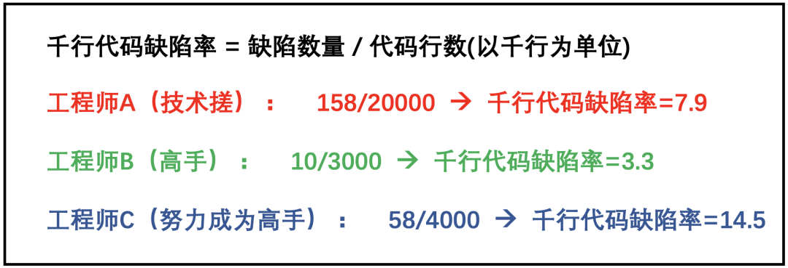
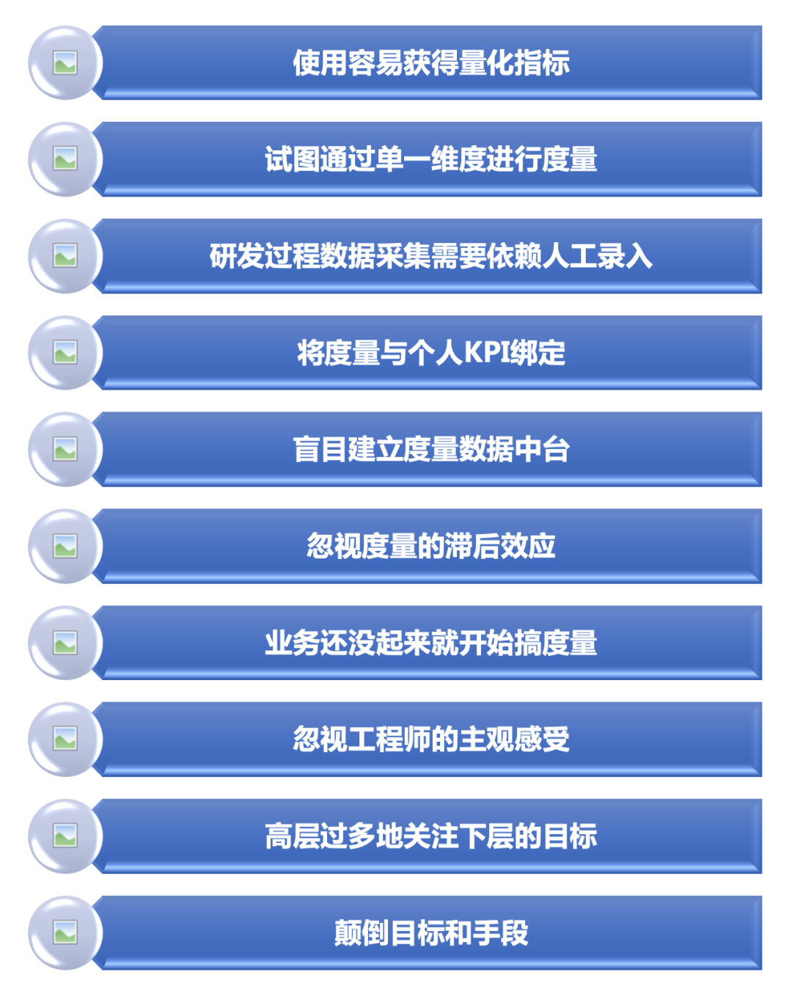

## 前言
前段时间我写了一篇文章《如何用研发效能搞垮一个团队》引起了业界同行大量的讨论与关注，今天想继续聊聊研发效能提升过程中另一个敏感话题：“度量”。讨论度量的目的不是争论对错，而是希望能够引发大家对这一话题的深入思考。

## 度量失败的案例
首先来看一些由于度量体系设计不当而引发“内卷”等不良行为的案例。

比如以“点击量”来度量自媒体运营的成果，那么就有可能出现点击量显著提升，但是公众号的关注人数却下降的现象。原因就是使用“标题党”等手段诱骗读者打开链接，但是实际内容名不副实，几次之后读者就不会继续关注该公众号了。

再比如以“手术成功率”来考核医生，医生就会刻意回避疑难杂症和重症病人，医生的“手术成功率”是提高了，但重症病人却得不到救治。

## 时代变了，很多事物底层逻辑都变了
今天的度量为什么容易失败呢？正如我在之前那篇文章中提到的，**面对变革，最重要的并不是方法和技术的升级，而应该是思维模式的升级。我们身处数字化的变革之中，需要将工业化时代科学管理的思维彻底转为字节经济时代的全新思维。**

对于软件研发效能的度量，我们绝大多数时候还在用工业化时代形成的管理理念来试图改进字节经济下的研发模式。**但时代变了，很多事物底层逻辑都已经变了，工业化时代形成的科学管理理念在字节经济的今天是否还依然适用？值得深思。**

本文将站在软件研发效能的视角，来探讨字节经济时代下研发效能度量中几个必须要回答的问题：
+ 研发效能到底要不要度量？
+ 研发效能到底能不能度量？
+ 研发效能到底如何来度量？
+ 研发效能的度量指标如何来选取？

## 研发效能到底要不要度量？

**要。这个问题的答案不容质疑。**

现代管理学之父 Peter Drucker 说过，“没有度量就没有改进”，这一底层逻辑自始至终都没有变过，只是工业化时代的度量和字节经济时代的度量在理念和方法上会有很多不同的地方。

**度量对于研发流程改进的意义非常明确。** 工业化时代的实体产品研发与生产，其中的风险是相对明显的，比较容易找到防范的方法，也分得清相关的责任。但是字节经济时代的软件产品研发（已经没有了生产），是通过越来越多工程师的数字化协作来推进的。**参与研发的人越多，人与人之间的沟通成本越高，产生随机偏差的概率也会越大，再加上软件研发过程本身的可视化程度很低，风险的可见性就容易被各个环节掩盖，但它最终会在看不见的地方积累起来。** 如果没有适当的度量体系去显性化这些风险，结果可想而知，更不用谈什么持续改进和治理了。

度量对于人的公平性诉求也是必须的。“我虽然没有功劳，但是我也有苦劳。” 大部分人可能只关注自己的付出，但并不关心付出所获得的实际效果。作为管理者应该为“苦劳鼓掌，为功劳付钱”。而功劳和苦劳的体现也需要借助客观的度量数据来体现，否则团队中的成员会逐渐陷入碌碌无为的窘境。

## 研发效能到底能不能度量？

明确了研发效能必须度量之后，我们再来看看一个更实际的问题：研发效能到底能不能度量？“要不要”和“能不能”是两个层面的问题，“要”不表示“能”，就像“我要赚钱”和“我能赚钱”是截然不同的两个问题一样。

关于这个问题，业界有两派截然不同的观点，一派是以现代管理学之父 Peter Drucker 的理论为依据，主张研发效能能够度量的；另一派是以世界级软件开发大师 Martin Fowler 为代表，主张研发效能不可度量的。

在这个问题上，我的观点比较中庸，我认为能够度量，但是没有完美的度量。原因有以下几点：

**1. 度量本身的片面性无法避免**

现实事物复杂而多面，度量正是为描述和对比这些具象事实而采取的抽象和量化措施，从某种意义上来说，度量的结果一定是片面的，只能反映部分事实。

**管理者往往会把目标拆解为可度量的指标。** 但是，目标和指标常常并不是简单的全局与局部的关系。目标的拆解过程看起来很顺畅，是那么地理所当然，但是当把拆解完的指标合并起来的的时候，结果往往让人哭笑不得。

有一个笑话说的是，“你问人工智能，我要找一个女朋友，像赵薇一样的大眼睛，像朱莉娅·罗伯茨一样的大嘴，喜爱运动，陆上运动、水上运动都会。人工智能就根据这几个指标给出了母青蛙的答案”。所以，指标和目标常常并不是充分必要的关系。

**2. 度量过程容易陷入局部思维**

指标是为了实现目标的，但是在实践过程中，指标很多时候却是与目标为敌的。

管理者常常把目标拆解为指标，时间久了以后，他就只知道指标，而忘了背后更重要的目标。如果目标是林，那么指标就是木，时间久了就是只见树木，不见森林。这个时候忘记了目标是什么的管理者就会变得非常短视。那些不懂数据的人很糟糕，而最最糟糕的人是那些只看数字的人。

在福特汽车的发展史上，有一段至暗时期。那些实践经验丰富，但是没有上过商学院的的老一辈管理层被干掉，取而代之的名校管理背景的数据分析师，公司试图通过精细化的数字管理来实现业务的增长。由于这些数据分析师并不熟悉业务，所以就只能看度量数据，越是不懂业务就越依赖度量数据来做决策，最后使整个公司陷入了泥潭。

软件研发也有类似的尴尬，为了更好地代码质量，所以就制定了严格的代码测试覆盖率要求。时间一久，大家都机械性的追求这个指标，而忘记了当时设立这个指标的初衷，于是就出现了高覆盖率的大量单元测试中没有断言这样尴尬的局面。

**3. 度量数据的解读具有很强的误导性**

度量数据本身不会骗人，但数据的呈现和解读却有很大的空间可以利用。很多时候，同样的数据，通过不同的解读会引导出截然不同的结果，这点很容易被人为利用来达成各自的目的。

举个例子，有研究人员问接受调查者一个问题：假如你得了绝症，有款新药可以治愈，但是会有风险，20% 的服用者可能因此而丧命，你吃吗？大多数人会选择不吃。但是如果反过来问：假如你得了绝症，有款新药可治愈 80% 的患者，但此外的人会死，你吃吗？绝大多数人会选择吃。实际上这两个问题的基本数据是一样的，但是得到的答案却相反。原因很简单，在前面的问题中，强调的是“失去”，在后面的问题中，强调的是“获得”。人的天性会更喜欢“获得”，而不是“失去”。

研发效能领域也有很多类似的案例，相同的数据到了不同的人的嘴里就有了截然不同的解读，由此做出的决策也会不同。

综上所述，**我认为研发效能到底能不能度量是要基于场景的，脱离了场景去谈能不能度量没有太大意义**。就像没有什么东西本质上就是脏的，是放错了位置的东西才是脏的。饭菜，在碗里就是干净的，泼到了衣服上才是脏的。泥土，在花园里就是干净的，抖落到了床上就是脏的。

## 研发效能到底如何度量？

那么研发效能到底如何度量，以下是我的一些想法。

**1. 要倾听管理者的度量诉求，但是不要照着做**

在汽车还没有被发明的时代，你问马车用户，你要一个什么样的交通工具，很有可能得到的答案是“更快的马车”，如果你按着这个思路去做的话，就会陷入研究马蹄设计、马饲料优化的误区，就不会有汽车的发明了。很多时候用户告诉你的需求往往都只是自以为是的“解决方案”。

当管理者告诉你我要这些度量数据、我要那些度量数据的时候，你不应该一头扎进数据获取的细节中，完全按管理者告诉你他想要的去做，而是应该从**本质上去理解管理者想要看这些数据背后真正的动机，管理者通过这些数据到底是想解决什么样的问题**。要理解管理者的深层次需求，这才是问题的本质。只有这样才有可能在此基础上给出相对完美的度量方案。

**2. 度量应该是有层级结构的**

高层管理者、中层管理者和一线工程师关心的度量维度肯定是不一样的。不要试图去提供一个看似大而全的度量体系，当你的度量体系能服务于所有人的时候，恰恰意味着它什么都不能。

比较理想的做法可以参考 OKR 的实践。先由高层管理者制定度量体系的总目标，然后中层管理者分解成可执行可量化的指标，最后再由一线工程师分解成工程维度的的指标。各个层级只关心当前层级的指标以及上一层级的目标，不应该出现高层过多、过细地关注下层指标。

**3. 度量的设计目标是要能够引导出正确的行为**

度量从来不是目的，而应该是实现目的的手段。度量是为目的服务的，所以好的度量设计一定对目的有正向牵引的作用，如果度量对目标的负向牵引大于正向牵引的话，这样的度量本质上就是失败的。

举个例子，现在国内很多软件企业都使用 Sonar 来实现代码静态质量的把控，为了推进 Sonar 在团队内的普及，不少企业会用“Sonar 项目接入率”这样的指标，也就是有多少百分比的项目已经在持续集成 CI 中启用了 Sonar，来衡量静态代码检查的普及率。这个指标看似中肯，实际上对于实现最终目标的牵引力是比较有限的。使用 Sonar 的最终目标是提升代码的质量，只是接入 Sonar 并不能实际改善代码的质量，而且还容易陷入为了接入而接入的指标竞赛。理解了这层逻辑，你会发现使用“Sonar 严重问题的平均修复时长”和“Sonar 问题的增长趋势”其实更有实践指导意义。

**所以，一个好的度量，一定要为解决本质问题服务，并且要能够引导出正确的行为。**

**4. 切记不要基于“比较思维”而采用“追星式”的度量**

我们看到一个人获得了成功，就会立刻认为他过去所有的行为都是那么地有道理。我们看到一公司获得了成功，就会觉得他们采取的策略和工程实践是多么有效。这正是“比较思维”的可怕之处。实际上，没有哪家企业是通过盯住竞争对手而获得成功的。

OKR 在 Google 的成功应用使得很多公司对此实践趋之若鹜，但是通过使用 OKR 取得成功的企业又有多少？这种“追星式”的度量只能让你陷入更深的内卷。

对于研发效能的度量体系，切记不要盲目生搬硬套“大厂”所谓的最佳实践，也不要拿自己的度量实践去和大厂的比较，你们的上下文不同、组织生态不同，这药给大厂吃可以治病，给你吃可能致命。

**5. 度量不要广撒网，而应该精准捕捞**

不要在没有任何明确改进目标的前提下开展大规模的度量，因为度量是有成本的，而且这个成本还不低。很多大型组织往往会花大成本去建立研发效能度量数据中台，指望通过研效大数据的分析来获取改进点。这种“广撒网”的策略虽然看似有效，实则收效甚微。事实证明，度量数据中台的建设成本往往会大幅度高于实际取得的效果。

比较理想的做法应该是通过对研发过程的深度洞察，发现有待改定的点，然后寻找能够证实自己观点的度量集合并采取相应的措施，最后再通过度量数据来证实措施的实际价值，这种“精准捕捞”的策略往往更具实用价值。

## 研发效能的度量指标如何选取？

这个问题太大了，很难展开。但是这里想通过两个典型案例来解释指标选取的问题。很多时候，当我们无法解释什么是正确的时候，我们可以通过逆向思维尝试着看看什么是错误的，以此来给我们一些启发。

**1. “千行代码缺陷率”引发的血案**

千行代码缺陷率是被大家广泛熟知并且不少企业正在使用的一个代码质量相关的度量指标，但是这个指标真的能客观反应代码的质量吗？这个指标真的是一个合格的指标吗？这里我不直接给出结论，而是带着大家一起来分析一下，让你自己得出结论。

上面的图给出了千行代码缺陷率的定义，即每千行代码的缺陷数量。假定一般情况下，团队平均的千行代码缺陷率大概是在 5-10 的范围。

现在我们有这么三个工程师：

- 工程师 A 的技术能力比较差，实现需求 X 用了 20000 行代码，同时引入了 158 个缺陷，由此计算出工程师 A 的千行代码缺陷率 =7.9，这个值正好在 5-10 这个平均范围内，所以从千行代码缺陷率来看，工程师 A 属于正常水平，并不会引起大家的注意，属于无功也无过。

- 工程师 B 是一个技术大牛，实现相同的需求 X 只用了 3000 行代码，但是也引入了 10 个缺陷，由此计算出工程师 B 的千行代码缺陷率 =3.3，这个值明显低于 5-10 这个平均范围，你以为工程师 B 会因此受到表扬？大错特错，工程师 B 很有可能会被判定为没有进行充分的测试，被责令加强测试。

- 工程师 C 是一个有技术追求、努力想让自己成为技术大牛的人，他实现相同的需求 X 用了 4000 行代码，但是由于目前的技术能力有限，所以引入了 58 个缺陷，由此计算出工程师 C 的千行代码缺陷率 =14.5，这个值明显高于 5-10 这个平均范围，所以毫无疑问，工程师 C 必然会遭受批评，被责令改进代码质量。

由此看出，基于千行代码缺陷率对这三个工程师的评价显然是有失公允的。

更糟糕的是，之后的需求有可能会发变化。这个时候工程师 B 和工程师 C 的代码具有较好的可维护性，可以方便地变更，所以可以很快完成变更任务，并且基本不会引入新缺陷。而工程师 A 的代码由于缺乏设计模式的支持，大量代码需要重写，同时还会引入了很多新缺陷。但是由于代码量够大，工程师 A 的千行代码缺陷率依旧在平均范围内。所以在现有的度量体系下，工程师 A 依然无功也无过，而工程师 B 和工程师 C 则继续得到差评，因为他们的工作看起来太简单了，明显工作量“不饱满”。

由此可见，**千行代码缺陷率的度量体系是失败的，其所传达的价值观与我们所期望的背道而驰**。从工程师 B 的遭遇可以看出“我们不相信你能够写出高质量的代码”，从工程师 C 的遭遇可以看出“我们不鼓励技术提升阶段的阵痛”，而从工程师 A 那边我们看到的是“我们欢迎那些平庸的程序员”，这些都直接违背了我们实际的价值观。

上述的分析还是在没有人为“粉刷”指标的前提下进行的，在实际工作中，工程师往往会采取稀释代码的方式来降低千行代码缺陷率，而不是实际去减少缺陷数量。因为与减少缺陷数量相比，直接稀释代码（比如：一行写成多行、括弧必须换行、多写注释、多加空行等）的难度更低，而且更可控。所以我一直说，永远不要低估工程师面对度量指标时的“创造性”。

此时度量体系的设计者可能很快会意识到工程师们的小手段，所以全新的“开发当量缺陷率”指标应运而生，这个指标用开发当量去替代千行代码数。**开发当量是对开发工作量的一种合理估计，可以理解为源代码编译成的抽象语法树 AST 的复杂度**。与代码行数这类浅层统计相比，开发当量不易受到编程习惯或特定行为的干扰（比如换行、注释等），这样一来，想通过稀释代码来降低代码缺陷率的路就走不通了。

乍一看，用开发当量似乎可以解决问题，但是当你深入思考后会发现，用开发当量可能会让情况更糟糕。因为工程师依旧可以通过人为增加开发当量（比如减少封装等）来降低代码缺陷率，只不过增加开发当量的难度比直接稀释代码要大，这将直接导致“粉刷”指标的难度变大，进而陷入“算法对抗”的窘境。最后的结果是工程师为了降低代码缺陷率，在错误的地方花费了更多时间和精力，而最终代码质量依旧没有任何改善。

那么到底是什么地方出了问题呢？你静下心来仔细想一下，代码行数和代码质量到底有没有关系？如果有关系，两者之间到底是因果关系还是仅仅是相关性？这时你可能会恍然大悟，**原来代码行数和代码质量之间仅仅是相关性，根本不是因果性，代码质量不会因为代码行数变多而变差**，所以试图用千行代码缺陷率来对代码质量进行度量的大前提根本就是不成立的，从源头上就错了。这就好像森林火灾率和冰淇淋销量之间就是相关性，这个相关性是由天热而发生关联的，两者之间不存在任何因果性。换言之，想通过降低冰淇淋销量来降低森林火灾率是完全行不通的。迷信千行代码缺陷率就好像扔砖头还要看风向一样自欺欺人。

那么正确的做法是什么呢？我们知道，只要缺陷可以很快被修复，那么有缺陷就并不可怕，缺陷多也不可怕，我们怕的是每个缺陷的修复难度都很高，一个缺陷几天都修不了，我们更怕缺陷修复对原有代码的改动会“伤筋动骨”。

所以我们完全可以**采用平均缺陷修复时间 (Mean Time To Repair) 来衡量代码的质量**。平均缺陷修复时间能够更好地反映代码本身的质量状况，以及团队的技术成熟度。往往平均修复时间较长的代码都是复杂度高、耦合度高的代码。而平均修复时间短的代码则是结构相对清晰、命名规范、容易理解、扩展和变更的代码。相比千行代码缺陷率，平均缺陷修复时间对代码质量会有更强的正向牵引作用。

**2. 敏捷模式下工作量估算的是是非非**

在敏捷模式下的工作量度量，到底应该用“故事点”作为单位呢，还是应该用“人天”作为单位？很多人可能觉得都可以，他们认为这个主要还是看团队的使用习惯。其实这个答案是完全错误的，正确的做法是用“故事点”，而不应该用“人天”。

要理解其中的缘由其实并不复杂，因为工作量是量的概念，而人天是时间的概念。要搬一千块砖，这一千块砖就是工作量的概念。

搬得快，它是一千块砖，搬得慢，还是一千块砖。工作量本身的大小和时间是没有关系的。

工作量与时间产生关系是通过速率这个概念。同样搬一千块砖，你每分钟搬 10 块，100 分钟搬完；我每分钟只能搬 5 块，那就 200 分钟搬完。所以，只有当速率确定了，才能把工作量换算成时间。

问题是当我们在计划迭代的时候，我们是没有办法明确知道速率值的，速率会随着很多因素动态变化，并不是一定不变量。比如工程师的熟练程度、是否之前处理过同类型的问题、需要参加会议的多少、家里的各种琐事都会对速率产生直接影响。因此我们无法将代表工作量的“故事点”和代表时间的“人天”等同起来。

为什么很多团队依然会直接使用时间来估算工作量，并认为“以故事点为单位”和“以人天为单位”没区别呢？因为在他们的观念中，速率是常量，所以工作量与时间就可以线性换算，所以这个看似“合理”假设，背后其实是一个巨大的逻辑错误。

## 总结

本文系统性探讨了研发效能度量的方方面面，重点聚焦研发效能度量的具体实践，同时通过千行代码缺陷率和敏捷工作量估算等具体案例讨论了度量指标选取的常见误区。

其实你会发现，研发效能度量的过程往往是对软件研发全流程进行抽象和简化的过程，但简化就会带来失真和扭曲，那些具有感性色彩、意味深长、需要反复斟酌的地方消失了，只剩下言之凿凿的度量指标，稍有不慎，就会让我们产生手握真理的幻觉。

那么在云原生的加持与数字化风潮下，企业应该如何快速融会贯通，推动研发效能升级？**本文作者茹炳晟**诚邀各位读者，参加**腾讯云 CIF 工程效能峰会 - 数字化风潮下的企业研发管理探索**论坛。来自不同企业的 5 位业内专家，将聚焦企业研发效能升级痛点，结合理论与实践，立足企业发展，放眼产业共建，通过真实案例帮助企业更高效、更高质量、更可靠、可持续地交付更优的业务价值。

**2021 年 10 月 19 - 20 日**

**CIF 线上峰会**火热报名中

[**扫描海报二维码**](https://coding.net/cifcon)

更多精彩议程等你开启！

